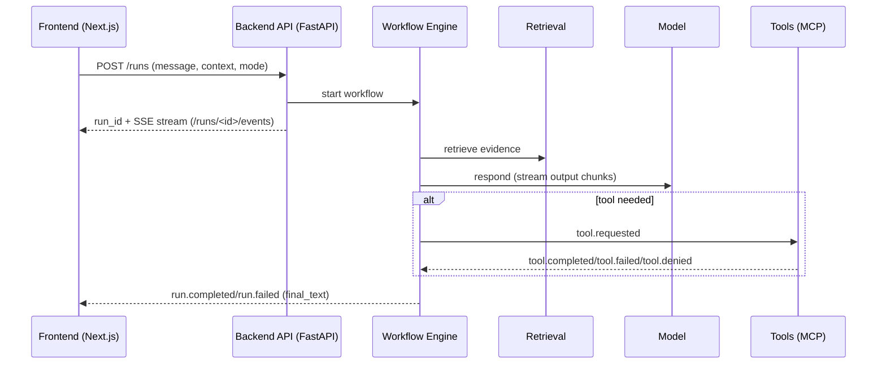

# AI Companion

An event-driven “AI agent in a box” you can run locally: chat UI + FastAPI backend with retrieval, a durable workflow engine, Model Context Protocol (MCP) tool execution, guardrails, tracing, and a deterministic evaluation harness.

Use it as a reference implementation for building observable, controllable agentic systems (and as a sandbox for experimenting with workflows, tool policies, and safety layers).

---

## Contents

- [What It Does](#what-it-does)
- [How It Works](#how-it-works)
- [Quickstart (Docker)](#quickstart-docker)
- [Local Development](#local-development)
- [Distributed Mode](#distributed-mode)
- [Observability (Events + Traces)](#observability-events--traces)
- [Guardrails](#guardrails)
- [Evaluation Suite](#evaluation-suite)
- [Configuration](#configuration)
- [Troubleshooting](#troubleshooting)

---

## What It Does

**AI Companion** runs an end-to-end “chat run” that is fully observable via streamed events:

- Accepts a message (+ optional context + mode)
- Plans what to do (answer directly, request a tool, ask for clarification, etc.)
- Retrieves evidence from a local markdown corpus
- Streams model output (or a deterministic local fallback when no API key is set)
- Optionally executes tools via **MCP** with explicit permissions and structured results
- Verifies grounding/citations and finalizes the run
- Persists state, events, and traces for replay/debugging

The frontend shows:

- Live output stream
- Workflow / node progress
- Decisions (plan type, tool selection, retrieval info, verification)
- Tools discovered/used + denial reasons
- Guardrail interventions
- Trace inspector timeline (`/runs/<run_id>/inspect`)

---

## How It Works

### Core idea: everything is an event

The backend persists and streams a **single source of truth**: events written to an event store and emitted over SSE. The UI is driven entirely by those events—no hidden client-side state machine.

### Typical flow



### Building blocks

- **Workflow engine**: durable step model with retries and “waiting” states (e.g., tool results, human approval).
- **Retrieval**: ingests markdown docs under `backend/data/docs`, chunks them, embeds them, and serves top-k similarity results.
- **Tools (MCP)**: registry + client + executor. Tools declare schemas and a permission scope; the executor enforces policies and emits structured lifecycle events.
- **Guardrails**: input/context/output/tool layers that can block unsafe behavior and emit clear, inspectable events.
- **Tracing**: spans for workflow steps, nodes, model calls, tool calls, waits, retries, etc.

---

## Quickstart (Docker)

Prereqs:

- Docker + Docker Compose

1) Create an env file:

```bash
cp .env.example .env
```

2) Start the stack:

```bash
docker compose -f infra/compose.yaml up --build
```

Open:

- Frontend: http://localhost:3000
- Backend: http://localhost:8000/health

Notes:

- The backend persists artifacts under `backend/data/` (events/state/workflow/traces).
- **By default, data is not wiped on startup.** If you want the old “reset every boot” behavior inside the backend container, set `CLEAR_DATA_ON_STARTUP=1`.

---

## Local Development

Prereqs:

- Python 3.11+
- Node.js 18+

### Backend

```bash
cd backend
python -m venv .venv
source .venv/bin/activate
pip install -r requirements.txt

python -m app.startup_checks
uvicorn app.main:create_app --factory --reload
```

### Frontend

```bash
cd frontend
npm install
npm run dev
```

If you run frontend on `:3000`, set:

```bash
NEXT_PUBLIC_BACKEND_URL=http://localhost:8000 npm run dev
```

---

## Distributed Mode

Distributed mode runs:

- Backend API (stateless-ish)
- Workflow worker (drives workflows)
- Tool worker (executes tool requests)
- Redis (event fanout + durable tool queue)

Start it with:

```bash
docker compose -f infra/compose.distributed.yaml up --build
```

Operational notes and validation steps live in:

- `docs/distributed_runbook.md`
- `docs/distributed_validation_checklist.md`

---

## Observability (Events + Traces)

### Events (SSE)

- `GET /runs/<run_id>/events` streams replay + live events as Server-Sent Events.
- Events are also persisted so you can replay runs later.

### Run state

- `GET /runs/<run_id>/state` returns the latest `RunState` snapshot (tools, retrieval, guardrails, etc.).
- `GET /runs/<run_id>/workflow` returns durable workflow state.

### Traces

- `GET /runs/<run_id>/trace` returns the full trace (envelope + spans).
- `GET /runs/<run_id>/spans` returns spans only.
- Frontend inspector: `http://localhost:3000/runs/<run_id>/inspect`

---

## Guardrails

Guardrails are layered controls that can refuse/stop execution and explain why:

- Input gate (pre-run safety checks)
- Retrieval context sanitization
- Prompt injection detection
- Output validation
- Tool firewall (permission + schema + rate limiting)

Guardrail interventions emit events like:

- `guardrail.triggered`
- `context.sanitized`
- `injection.detected`

---

## Evaluation Suite

The evaluation harness replays runs deterministically against a dataset and scores behavior (retrieval, grounding, tool behavior, verification).

Run it:

```bash
cd backend
python -m app.eval.run
```

Artifacts:

- `backend/data/eval/report.json`
- Per-case results under `backend/data/eval/cases/`

---

## Configuration

Copy `.env.example` → `.env`. Key variables:

| Variable | Purpose |
| --- | --- |
| `OPENAI_API_KEY` | Optional. Enables real model streaming; otherwise a deterministic fallback streamer is used. |
| `MODEL_ROUTING_DEFAULT_MODEL` | Default model for routing. |
| `MODEL_ROUTING_<CAPABILITY>_MODEL` | Override a capability model (e.g. `MODEL_ROUTING_VERIFICATION_MODEL`). |
| `RUN_MODEL_BUDGET_USD` | Per-run spend cap (0 disables). |
| `RATE_LIMIT_GLOBAL_CONCURRENCY` / `RATE_LIMIT_TENANT_CONCURRENCY` | Concurrency limits. |
| `CACHE_RETRIEVAL_ENABLED` / `CACHE_TOOL_RESULTS_ENABLED` | Feature flags for caches. |
| `BACKEND_MODE` | `single_process` (default) or `distributed`. |
| `REDIS_URL` | Required when `BACKEND_MODE=distributed`. |
| `NEXT_PUBLIC_BACKEND_URL` | Frontend → backend URL. |
| `GITHUB_TOKEN` | Optional. Enables GitHub MCP tool calls (read-only). |
| `CLEAR_DATA_ON_STARTUP` | Optional. Set to `1` to wipe `data/events` + `data/state` on container boot. |

---

## Troubleshooting

### “Startup check failed: Missing required environment variable …”

Ensure you copied `.env.example` to `.env` and are loading it (Docker does via `env_file`).

### “Redis transport requested…” / worker won’t start

Distributed mode requires Redis and `BACKEND_MODE=distributed` + `REDIS_URL` set.

### Tools are discovered but denied

Tool execution is permission-gated. In development, calculator is allowed; GitHub tools also require a `GITHUB_TOKEN`.

### No output / UI looks stuck

- Open the run inspector: `http://localhost:3000/runs/<run_id>/inspect`
- Check for `workflow.waiting_for_event`, `workflow.waiting_for_approval`, tool spans, or guardrail events.
